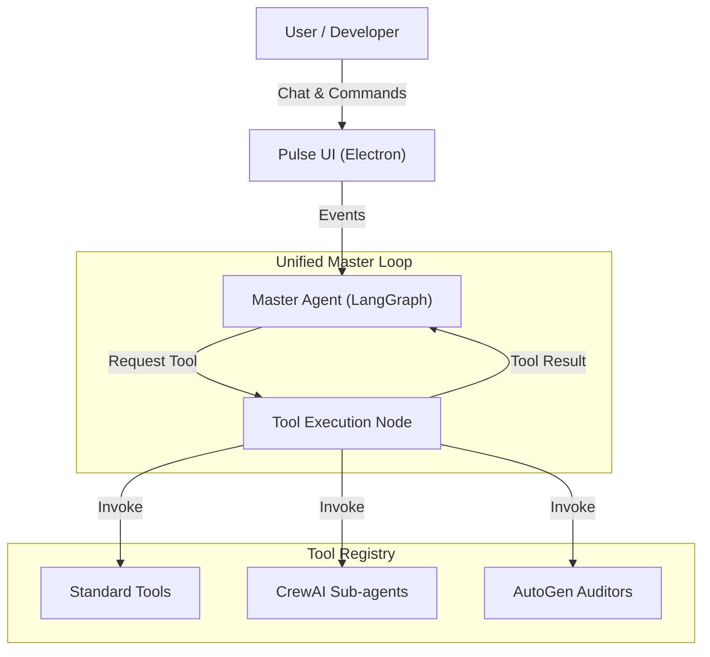

# Product Requirements Document (PRD) - Pulse Agentic IDE

## 0. Introduction Video link
https://drive.google.com/file/d/1IqdAvl875pGhRKbQQ0rtz0mFksP5q7v0/view?usp=sharing

## 1. Executive Summary
- **Product Name**: Pulse Agentic IDE
- **Version**: 0.1.x (Initial Release Phase)
- **Platform**: Desktop Application (Electron + Python)
- **Vision**: To democratize access to advanced AI pair programming by providing a professional-grade, token-based Desktop IDE that puts developers in full control of their costs, models, and data. Unlike subscription-based competitors (Cursor, Windsurf), Pulse operates on a "Bring Your Own Key" (BYOK) model, eliminating monthly fees and vendor lock-in.
- **Value Proposition**:
    - **Zero Markup / No Subscription**: Users pay only the direct API costs to providers.
    - **Unified "Brain"**: Orchestrates **LangGraph**, **CrewAI**, and **AutoGen** into a cohesive single-agent experience.
    - **Industrial First**: Native support for **IEC 61131-3 (Structured Text)**, addressing a critical gap in the OT/ICS market.
    - **Model Freedom**: Switch instantly between OpenAI, Anthropic, and Google Gemini models mid-conversation.

## 2. Target Audience & User Personas

| Persona | Role | Pain Points | Pulse Solution |
|---------|------|-------------|----------------|
| **The Independent Builder** | Senior Full-Stack Dev | Hates $20/mo subscriptions for tools they use sporadically. Wants access to SOTA models without platform markup. | **Pay-per-token** model with direct API access. No usage caps. |
| **The OT/SCADA Engineer** | Industrial Automation | AI tools hallucinate on `Structured Text`; lack context of PLC hardware; security compliance blocks cloud SaaS. | **Local-first architecture** with specialized prompting for IEC 61131-3. |
| **The AI Researcher** | ML Engineer / Hobbyist | Needs to test different models (Gemini vs GPT-5) on the same codebase to benchmark performance. | **Model toggle** allows hot-swapping providers in the same chat session. |

## 3. Functional Requirements (Core Features)

### 3.1 Desktop Application (Electron)
- **Native Experience**: Fully integrated desktop app (Windows primary) combining a VS Code-like editor (Monaco), Terminal (Xterm.js), and Chat Interface.
- **Local Persistence**: All chat history, settings, and workspace data stored in `.pulse/` in the project root directory only.
- **Secure Configuration**: API keys are stored in the OS credential store or local `.env` file, never transmitted to Pulse servers.

### 3.2 Multi-Agent Orchestration ("The Brain")
Pulse uses a **Hub-and-Spoke** architecture to coordinate specialized agents:
- **Master Agent (LangGraph)**: The central decision maker. It manages the conversation state, memory (`Rolling Summary`), and high-level planning.
    - *Interrupt-Resume*: Supports "Human-in-the-Loop" for approvals.
- **Sub-Agent Tools (Spokes)**:
    - **CrewAI**: "Builder Crew" (Planner -> Coder -> Reviewer) for complex implementation tasks.
    - **AutoGen**: "Auditor Swarm" for multi-agent debate and security reviews.
    - **Standard Tools**: File operations, terminal execution, RAG search.

### 3.3 Model Management ("The Engine")
- **Multi-Provider Support**: Direct integration with major LLM providers.
    - **OpenAI**: Support for `gpt-5.x` series.
    - **Anthropic**: Support for `claude-sonnet-4.5`, `claude-opus-4.5`.
    - **Google**: Support for `gemini-3-pro`, `gemini-3-flash`.
- **Cost Transparency**:
    - Real-time session cost tracking (USD).
    - Granular breakdown by model usage.
    - Configurable token budgets to prevent runaway costs.

### 3.4 Collaboration & Safety
- **Terminal Guardrails**:
    - **Pre-execution Risk Analysis**: Classifies commands as Low, Medium, or High risk.
    - **Blocking**: High-risk commands (e.g., `rm -rf`, `drop table`) require explicit, non-enter-key confirmation.
- **Unified Diff Viewer**: All file changes are presented as diffs for user review before application.

## 4. Non-Functional Requirements
- **Performance**:
    - **Startup Time**: < 3 seconds to interactive state.
    - **Latency**: WebSocket interactions < 50ms (excluding LLM inference time).
- **Scalability**:
    - Architecture supports "Lazy Loading" of tools to keep memory footprint low.
- **Compatibility**:
    - **OS**: Windows 10/11 (x64).
    - **Shell**: PowerShell and CMD support.
- **Reliability**:
    - **Graceful Degradation**: If standard synthesis fails, fallback to simple completion.
    - **Retry Logic**: Exponential backoff for API rate limits.

## 5. System Architecture & Tech Stack

### 5.1 Architecture Diagram
The layout follows a "Hub-and-Spoke" model where the Master Agent coordinates all operations:

### 5.2 Technology Stack
- **Core AI**: `LangGraph` (Orchestrator), `LangChain` (Interfaces).
- **Sub-Agents**: `CrewAI`, `PyAutoGen`.
- **Vector DB**: `ChromaDB` (Local RAG).
- **Packaging**: `PyInstaller` (Backend), `electron-builder` (Frontend/Installer).

## 6. Future Roadmap (v0.2+)

### 6.1 Performance & Efficiency (P0)
- **Prompt Caching**: Implementation of context caching to reduce input token costs by up to 90%.
- **Parallel Tool Execution**: Allowing the Master Agent to run non-dependent tools (e.g., `search` and `read_file`) concurrently.
- **State Compression**: Compressing massive graph states to allow longer context windows without memory bloat.

### 6.2 New Integrations (P1)
- **Git Operations**: Full native support for `git push/pull/commit` and PR management.
- **Local LLMs**: Integration with **Ollama** and **LM Studio** for offline, private coding (Privacy-First Mode).
- **Plugin System**: A manifest-based plugin architecture allowing users to add custom tools (e.g., Jira integration, AWS deployment).

### 6.3 Industrial & Enterprise (P2)
- **PLC Simulator**: In-built simulation engine for testing Structured Text logic without hardware.
- **Ladder Logic Converter**: Bi-directional conversion between Text (ST) and visual Ladder Logic.
- **Multi-Tenant Server**: "Pulse Server" mode for team deployments on on-prem infrastructure.

## 7. Success Metrics
- **User Retention**: > 40% of users returning for >= 3 sessions/week.
- **Cost Savings**: Users saving > 50% comparing Pulse usage vs. fixed $20/mo subscriptions.
- **Stability**: < 1% crash rate on Windows 11.

---
*Authored by: Kathan (Lead Architect / Product Manager)*
*Date: January 2026*
