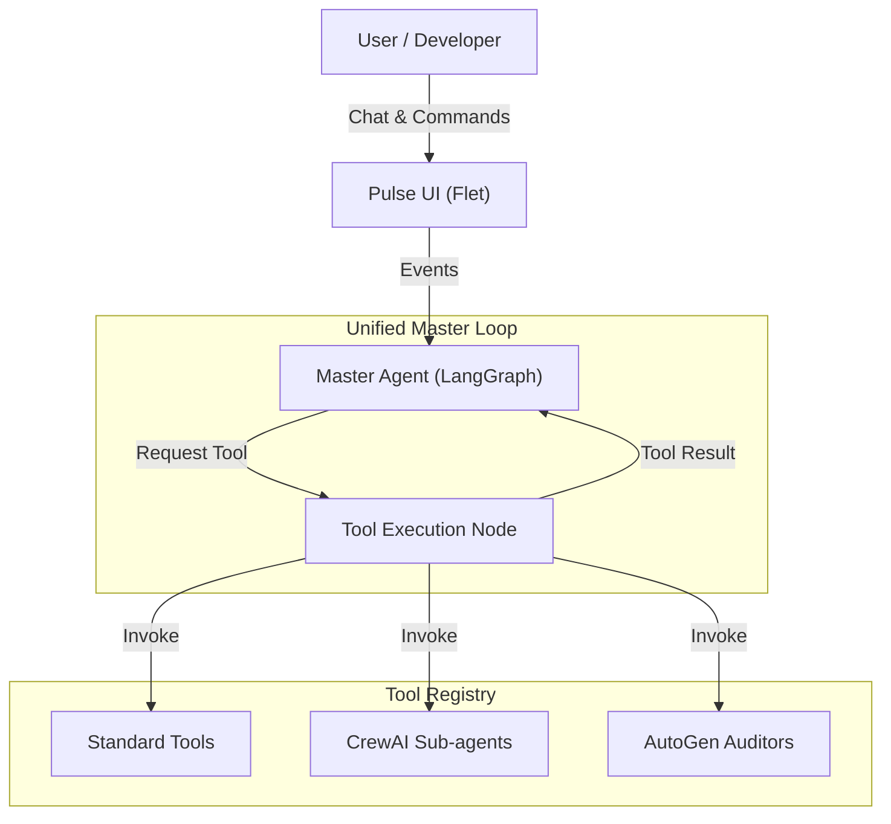

<table style="border: none !important; border-collapse: collapse;">
  <tr style="border: none !important;">
    <td style="border: none !important; padding-right: 20px; vertical-align: middle;">
      <span style="font-size: 32px; font-weight: bold;">Pulse Agentic IDE</span>
    </td>
    <td style="border: none !important; vertical-align: middle;">
      
    </td>
  </tr>
</table>

<div align="center">
  
  
  <br />
  
  [](https://opensource.org/licenses/MIT)
  [](https://www.python.org/downloads/)
  [](https://flet.dev)
  [](https://langchain-ai.github.io/langgraph/)

  <h3>The First IDE Designed for Agent-Human Collaboration</h3>

  <p><i><b>Pulse</b> is not just an autocomplete tool. It is a fully autonomous coding partner that lives in your editor, capable of planning, executing, and verifying complex software engineering tasks.</i></p>
</div>

---

## 🚀 Overview

Pulse is a **next-generation Agentic IDE** built for developers who want to supervise AI, not just prompt it. Unlike standard copilots that only autocomplete code, Pulse runs a **multi-agent system** (LangGraph + CrewAI + AutoGen) directly on your machine. It can:

*   **Plan** complex features across multiple files.
*   **Execute** terminal commands safely with user approval.
*   **Verify** its own work before showing it to you.
*   **Audit** your codebase for security and architectural flaws.

---

## ✨ Key Features

### 🧠 **Review-Driven Development**
Pulse doesn't just "guess." It proposes changes using **Patch Previews**. You review the diff, approve or reject it, and Pulse applies the changes transactionally.

### 🛡️ **Enterprise-Grade Safety**
*   **Terminal Guardrails**: Every shell command is analyzed for risk (Low/Med/High). Dangerous commands require explicit approval.
*   **Sandboxed Execution**: Agents operate within strict bounds, protecting your system files.

### 🤖 **Multi-Agent Architecture**
### 🤖 **Multi-Agent Architecture**
Pulse uses a **Unified Master Loop** (Hub-and-Spoke) to orchestrate specialized capabilities:
*   **Master Agent (LangGraph)**: The central brain that routes queries and executes tools.
*   **Builder Crew (CrewAI)**: Invoked as a **tool** for complex feature implementation (Planner, Coder, Reviewer).
*   **Auditor Swarm (AutoGen)**: Invoked as a **tool** for independent code quality and security analysis.

### 🏭 **PLC & Industrial Automation Support**
Specialized capabilities for generating and checking **Structured Text (IEC 61131-3)** code, making it the first AI IDE tailored for OT/ICS engineers.

---

## 🛠️ Technology Stack

Pulse is an engineering showcase leveraging the absolute bleeding edge of AI frameworks.

### **Core AI Engine**
*   **LangGraph**: For stateful, cyclic agent workflows.
*   **LangChain**: Tool abstraction and model interfacing.
*   **CrewAI**: Role-playing agent orchestration for creative tasks.
*   **Microsoft AutoGen**: Multi-agent conversation framework for critical auditing.

### **Frontend & System**
*   **Python**: 100% Python-native architecture.
*   **Flet (Flutter for Python)**: Reactive, cross-platform UI.
*   **Chromadb**: Vector store for semantic codebase search.
*   **Platformdirs**: OS-compliant configuration management.

---

## 🏗️ Architecture



---

## 📥 Installation

1.  **Clone the Repository**:
    ```bash
    git clone https://github.com/Kathan03/Pulse-Agentic_AI_IDE_for_PLC_Coding.git
    cd Pulse
    ```

2.  **Set up Environment**:
    ```bash
    python -m venv venv
    .\venv\Scripts\activate
    pip install -r requirements.txt
    ```

3.  **Run Pulse**:
    ```bash
    python main.py
    ```

---

## 🔮 Roadmap: The Move to Electron

We are currently transitioning Pulse from a Python/Flet application to a **Commercial-Grade Electron App**. 

*   **Current**: Python + Flet (Functional, Robust)
*   **Future**: Electron + Monaco Editor (VS Code Engine) + Python Backend.
*   **Goal**: To provide a seamless, high-performance editor experience identical to VS Code but deeply integrated with the Pulse Agent.

---

<div align="center">
  <p>Built with ❤️ by Kathan | Top-Tier AI Engineering</p>
</div>
