# Pulse Agentic IDE 

<div align="center">
  
  
  <br />
  
  [](https://opensource.org/licenses/MIT)
  [](https://www.python.org/downloads/)
  [](https://nodejs.org/)
  [](https://www.electronjs.org/)
  [](https://www.typescriptlang.org/)
  [](https://github.com/Kathan03/Pulse-Agentic_IDE/actions)

  <h3>🚀 The First AI IDE Designed for Agent-Human Collaboration</h3>

  <p><i><b>Pulse</b> is not just another autocomplete tool. It's a fully autonomous coding partner powered by <b>LangGraph</b>, <b>CrewAI</b>, and <b>AutoGen</b> — capable of planning, executing, and verifying complex software engineering tasks across your entire codebase.</i></p>
</div>

---

## 🎯 Why Pulse?

### The Problem with Current AI Coding Tools

| Feature | GitHub Copilot / Cursor | **Pulse** |
|---------|------------------------|-----------|
| **Pricing** | $20/month subscription | **Pay only for what you use** |
| **Model Lock-in** | Proprietary models only | **Any model: OpenAI, Anthropic, Google Gemini** |
| **Agent Capabilities** | Autocomplete-focused | **Full agentic workflow: Plan → Execute → Verify** |
| **PLC/Industrial Support** | None | **First-class IEC 61131-3 support** |
| **Terminal Access** | Limited or none | **Full terminal with safety guardrails** |

### 💰 Cost Savings Example

With subscription-based tools, you pay **$20/month** regardless of usage. With Pulse:
- Light usage month: **~$5-10** → **Save $10-15**
- Heavy usage month: **~$15-20** → Pay only what you use
- No usage: **$0** → No wasted subscription fees

**You bring your own API keys. You control your costs.**

---

## ✨ Key Features

### � **Multi-Agent Architecture**
Pulse orchestrates multiple AI agents working in concert:
- **Master Agent (LangGraph)**: Stateful reasoning engine with cyclic workflows
- **Builder Crew (CrewAI)**: Role-based agents for complex feature implementation
- **Auditor Swarm (AutoGen)**: Multi-agent debates for code review and security analysis

### 🔌 **Multi-Provider LLM Support**
Use any model from any provider — switch models mid-conversation:
- **OpenAI**: GPT-4, GPT-4-Turbo, GPT-3.5
- **Anthropic**: Claude 3.5 Sonnet, Claude 3 Opus, Claude 3 Haiku
- **Google Gemini**: Gemini 1.5 Pro, Gemini 1.5 Flash

### 🛡️ **Enterprise-Grade Safety**
- **Terminal Guardrails**: Commands analyzed for risk (Low/Medium/High)
- **Diff Previews**: Review every file change before applying
- **Approval Workflows**: Dangerous operations require explicit user consent

### 🏭 **PLC & Industrial Automation**
Specialized capabilities for **Structured Text (IEC 61131-3)** programming:
- First AI IDE tailored for OT/ICS engineers
- Also supports general-purpose programming (Python, TypeScript, etc.)

### 💬 **Conversation History**
Persistent chat history with context-aware assistance across sessions.

---

## 🛠️ Technology Stack

This project showcases proficiency across the full stack of modern AI engineering:

### **AI/ML Frameworks**
| Framework | Purpose |
|-----------|---------|
| **LangGraph** | Stateful, cyclic agent workflows with tool execution |
| **LangChain** | LLM abstraction, tool definitions, prompt management |
| **CrewAI** | Role-based multi-agent orchestration |
| **AutoGen (Microsoft)** | Multi-agent conversation and debate framework |

### **LLM Provider SDKs**
| SDK | Provider |
|-----|----------|
| **OpenAI SDK** | GPT-4, GPT-3.5 |
| **Anthropic SDK** | Claude 3.5 Sonnet, Claude 3 Opus |
| **Google Generative AI SDK** | Gemini 1.5 Pro, Gemini Flash |

### **Backend**
| Technology | Purpose |
|------------|---------|
| **Python 3.11+** | Core backend language |
| **FastAPI** | WebSocket server for real-time communication |
| **SQLite** | Conversation history persistence |
| **ChromaDB** | Vector database for semantic codebase search |
| **PyInstaller** | Backend bundling for distribution |

### **Frontend**
| Technology | Purpose |
|------------|---------|
| **Electron 28** | Desktop application framework |
| **React 18** | UI component library |
| **TypeScript** | Type-safe frontend code |
| **Monaco Editor** | VS Code's editor engine |
| **Vite** | Fast build tooling |
| **Xterm.js** | Terminal emulation |

### **DevOps & CI/CD**
| Technology | Purpose |
|------------|---------|
| **GitHub Actions** | Automated CI/CD pipeline |
| **electron-builder** | Windows installer generation (NSIS) |
| **pytest** | Python test framework |
| **ESLint** | TypeScript linting |
| **Ruff** | Python linting |

> **Note**: The UI was initially prototyped with Flet (Flutter for Python) for rapid iteration, then migrated to Electron + React for production-grade UX.

---

## 🏗️ Architecture

Pulse uses a **Hub-and-Spoke** architecture where the Master Agent coordinates all operations:

```mermaid
graph TD
    User["👤 User"] -->|Chat & Commands| UI["🖥️ Electron UI"]
    UI <-->|WebSocket| Server["⚡ FastAPI Server"]
    Server --> Master["🧠 Master Agent"]

    subgraph "Unified Master Loop (LangGraph)"
        Master -->|Route| Decision{Needs Sub-Agent?}
        Decision -->|No| Tools["🔧 Direct Tool Execution"]
        Decision -->|Yes| SubAgents["🤖 Sub-Agent Invocation"]
        Tools --> Master
        SubAgents --> Master
    end

    subgraph "Tool Registry"
        Tools --> FileOps["📁 File Operations"]
        Tools --> Terminal["💻 Terminal"]
        Tools --> Search["🔍 Codebase Search"]
        Tools --> Patch["📝 Patch/Diff"]
    end

    subgraph "Sub-Agents (Invoked as Tools)"
        SubAgents --> CrewAI["👥 CrewAI Builder"]
        SubAgents --> AutoGen["🔒 AutoGen Auditor"]
    end

    CrewAI --> |Planner + Coder + Reviewer| Master
    AutoGen --> |Security + Quality Analysis| Master
```



**Key Design Decisions:**
- **LangGraph** provides the core loop with state persistence and cyclic execution
- **CrewAI** and **AutoGen** are invoked as **tools**, not independent workflows
- **WebSocket** enables real-time streaming of agent responses
- **Tool approvals** intercept dangerous operations before execution

---

## � CI/CD Pipeline

Pulse features a fully automated build and release pipeline:

### **Continuous Integration (`ci.yml`)**
Triggered on every push and pull request:
- ✅ Python linting (Ruff)
- ✅ TypeScript linting (ESLint)
- ✅ Python tests (pytest)
- ✅ TypeScript type checking
- ✅ Electron build verification

### **Automated Releases (`release.yml`)**
Triggered on version tags (`v*`):
1. **Build Python backend** → `pulse-server.exe` (PyInstaller)
2. **Build Electron app** → `Pulse-Setup-{version}.exe` (electron-builder)
3. **Create GitHub Release** with checksums and changelog

```bash
# To create a release:
git tag v0.1.0
git push origin v0.1.0
# → Automatically builds and publishes installer!
```

---

## 📥 Installation

### Option 1: Download Installer (Recommended)
1. Go to [Releases](https://github.com/Kathan03/Pulse-Agentic_IDE/releases)
2. Download `Pulse-Setup-{version}.exe`
3. Run the installer
4. Configure your API keys in Settings

### Option 2: Build from Source

```bash
# Clone the repository
git clone https://github.com/Kathan03/Pulse-Agentic_IDE.git
cd Pulse-Agentic_IDE

# Backend setup
python -m venv venv
.\venv\Scripts\activate  # Windows
pip install -r requirements.txt

# Frontend setup
cd pulse-electron
npm install

# Run in development mode
npm run dev  # In one terminal
python -m src.server.main  # In another terminal
```

---

## ⚙️ Configuration

Configure your API keys in the Settings panel (or via `.env` file):

```env
OPENAI_API_KEY=sk-...
ANTHROPIC_API_KEY=sk-ant-...
GOOGLE_API_KEY=AI...
```

**Supported Models:**
- OpenAI: `gpt-4`, `gpt-4-turbo`, `gpt-3.5-turbo`
- Anthropic: `claude-3-5-sonnet-20241022`, `claude-3-opus-20240229`
- Google: `gemini-1.5-pro`, `gemini-1.5-flash`

---

## 📂 Project Structure

```
Pulse/
├── .github/workflows/     # CI/CD pipelines
│   ├── ci.yml             # Continuous integration
│   └── release.yml        # Automated releases
├── pulse-electron/        # Electron + React frontend
│   ├── electron/          # Main process (TypeScript)
│   ├── src/               # React components
│   └── package.json       # Frontend dependencies
├── src/                   # Python backend
│   ├── agents/            # LangGraph, CrewAI, AutoGen
│   ├── server/            # FastAPI WebSocket server
│   ├── tools/             # Tool implementations
│   └── llm_client.py      # Multi-provider LLM abstraction
├── tests/                 # pytest test suite
└── requirements.txt       # Python dependencies
```

---

## 🔮 Roadmap

- [x] **Phase A**: Core agent architecture (LangGraph + Tools)
- [x] **Phase B**: Electron UI with Monaco Editor
- [x] **Phase C**: CI/CD pipeline with automated releases
- [ ] **Future**: macOS and Linux builds
- [ ] **Future**: VS Code extension integration
- [ ] **Future**: Cloud deployment option

---

## 📜 License

MIT License - see [LICENSE](LICENSE) for details.

---

<div align="center">
  <p>Built with ❤️ by <b>Kathan Shah</b></p>
  <p><i>Demonstrating expertise in AI/ML Engineering, Full-Stack Development, and DevOps</i></p>
</div>
