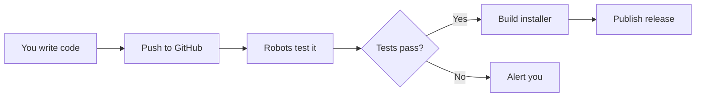
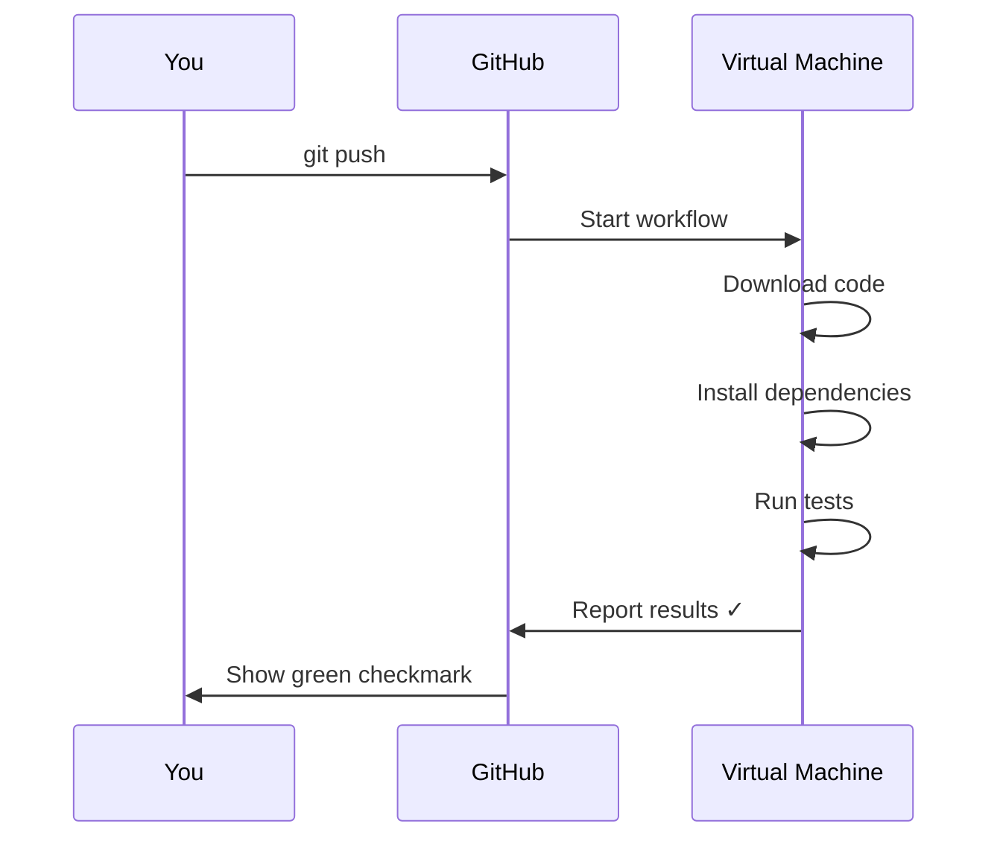
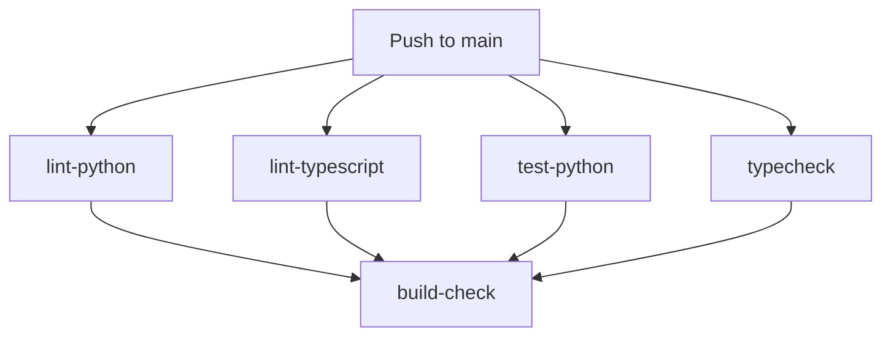
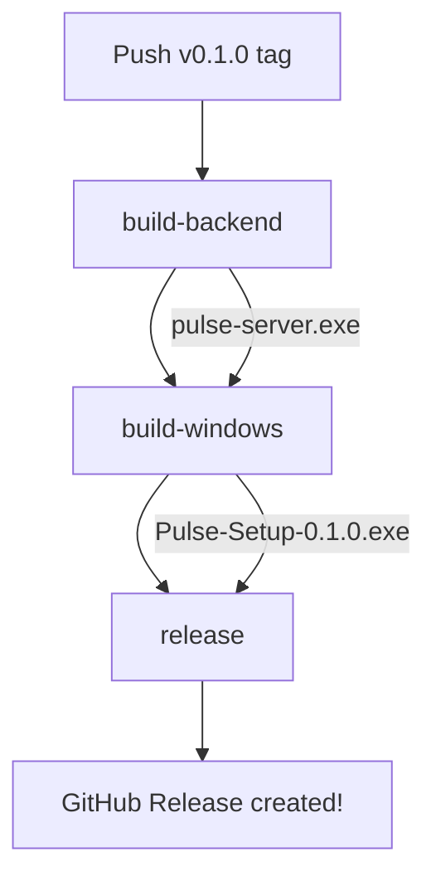

# CI/CD Guide: Understanding GitHub Actions for Pulse IDE

This guide explains the CI/CD pipeline for Pulse, designed for complete beginners.

---

## What is CI/CD?

**CI/CD** stands for **Continuous Integration / Continuous Deployment** (or Delivery).

Think of it like an **automated factory for your code**:



| Term | What it means |
|------|---------------|
| **Continuous Integration (CI)** | Every time you push code, it's automatically tested |
| **Continuous Deployment (CD)** | When you create a release, it's automatically built and published |

### Why do we need it?

**Before CI/CD:**
1. Write code
2. Manually run tests
3. Manually build the app
4. Manually upload to GitHub
5. Hope nothing broke

**With CI/CD:**
1. Write code
2. Push to GitHub
3. ✨ Everything else is automatic ✨

---

## What is GitHub Actions?

**GitHub Actions** is GitHub's built-in automation system. It runs scripts in response to events.

### Key Concepts

| Concept | Explanation |
|---------|-------------|
| **Workflow** | A YAML file defining what to automate (lives in `.github/workflows/`) |
| **Trigger** | What starts the workflow (push, pull request, tag) |
| **Job** | A set of steps that run on a virtual machine |
| **Step** | A single command or action |
| **Actions** | Pre-built scripts you can reuse (like `actions/checkout@v4`) |

### How a Workflow File Works

Here's a simplified version of our CI workflow:

```yaml
name: CI                          # Name shown in GitHub UI

on:                               # WHEN does this run?
  push:
    branches: [main]              # On push to main branch

jobs:                             # WHAT does it do?
  test:                           # Job name
    runs-on: ubuntu-latest        # Use a Linux virtual machine
    steps:                        # Individual commands
      - uses: actions/checkout@v4 # Download your code
      - run: pytest               # Run tests
```

### Visualization



---

## What is a GitHub Release?

A **GitHub Release** is a snapshot of your code with downloadable files attached.

Think of it like a "version checkpoint" that users can download:

```
Pulse Releases
├── v0.1.0 ← You are here
│   └── Pulse-Setup-0.1.0.exe
├── v0.2.0 (future)
│   └── Pulse-Setup-0.2.0.exe
└── v1.0.0 (future)
    └── Pulse-Setup-1.0.0.exe
```

### Git Tags

**Tags** are bookmarks in your Git history:

```bash
git tag v0.1.0          # Create a tag at current commit
git push origin v0.1.0  # Push tag to GitHub → Triggers release!
```

---

## Pulse CI/CD Workflow Files

### File Summary

| File | Purpose |
|------|---------|
| `.github/workflows/ci.yml` | Tests code on every push |
| `.github/workflows/release.yml` | Builds installer when you create a release |
| `pulse-electron/electron-builder.json` | Configures the Windows installer |
| `docs/RELEASING.md` | Documents the release process |

### CI Workflow (`ci.yml`)

**Triggers:** Every push to `main`, every Pull Request

**What it does:**



1. **lint-python** - Checks Python code style with `ruff`
2. **lint-typescript** - Checks TypeScript code style with `eslint`
3. **test-python** - Runs pytest tests
4. **typecheck** - Verifies TypeScript types
5. **build-check** - Verifies the app can be built (runs on Windows)

### Release Workflow (`release.yml`)

**Triggers:** Pushing a tag like `v0.1.0`

**What it does:**



1. **build-backend** - Uses PyInstaller to create `pulse-server.exe`
2. **build-windows** - Uses electron-builder to create `Pulse-Setup-0.1.0.exe`
3. **release** - Creates a GitHub Release with the installer attached

---

## Manual Verification Guide

### Step 1: Push Code to GitHub

```bash
# Check what's new
git status

# Add all new files
git add .

# Commit
git commit -m "feat: add CI/CD pipeline with GitHub Actions"

# Push to main
git push origin main
```

### Step 2: Watch CI Run

1. Go to your GitHub repository
2. Click the **Actions** tab
3. You should see "CI" workflow running
4. Click on it to see the jobs

### Step 3: Create Your First Release

Once CI passes, create a release:

```bash
# Create a version tag
git tag v0.1.0

# Push the tag (triggers release workflow)
git push origin v0.1.0
```

### Step 4: Watch Release Build

1. Go to **Actions** tab
2. You should see "Release" workflow running
3. This takes ~10-15 minutes (building Python + Electron)

### Step 5: Download and Test Installer

1. Go to **Releases** (on the right side of your repo page)
2. Find **Pulse v0.1.0**
3. Download `Pulse-Setup-0.1.0.exe`
4. Run the installer:
   - Click **Next**
   - Choose install location (default: `C:\Program Files\Pulse`)
   - Click **Install**
   - Check "Create Desktop Shortcut" if desired
   - Click **Finish**

### Step 6: Verify Installation

- [ ] `C:\Program Files\Pulse\Pulse.exe` exists
- [ ] Start Menu has "Pulse" shortcut
- [ ] Desktop shortcut works (if created)
- [ ] Double-click Pulse.exe → Application launches
- [ ] Backend starts automatically (check if agent responds to messages)

---

## Troubleshooting

### CI Failed

1. Click on the failed workflow in Actions
2. Expand the failed step
3. Read the error message
4. Common issues:
   - Linting errors → Fix code style
   - Test failures → Fix failing tests
   - Build errors → Check dependencies

### Release Failed

1. Check if CI passed first (release depends on clean code)
2. Look at which job failed:
   - **build-backend** → PyInstaller issue
   - **build-windows** → Electron builder issue
   - **release** → GitHub token issue

### Tag Already Exists

If you need to recreate a release:

```bash
git tag -d v0.1.0              # Delete local tag
git push origin :v0.1.0        # Delete remote tag
# Fix the issue, then:
git tag v0.1.0
git push origin v0.1.0
```

---

## Quick Reference

| Action | Command |
|--------|---------|
| Run CI manually | Push to main or create PR |
| Create release | `git tag v0.1.0 && git push origin v0.1.0` |
| Check workflow status | GitHub → Actions tab |
| Download installer | GitHub → Releases |
